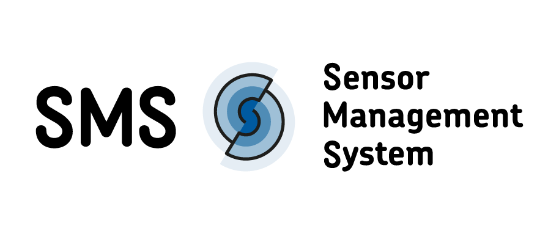

<!--
SPDX-FileCopyrightText: 2021 - 2024
- Kotyba Alhaj Taha <kotyba.alhaj-taha@ufz.de>
- Nils Brinckmann <nils.brinckmann@gfz-potsdam.de>
- Tobias Kuhnert <tobias.kuhnert@ufz.de>
- Norman Ziegner <norman.ziegner@ufz.de>
- Helmholtz Centre Potsdam - GFZ German Research Centre for Geosciences (GFZ, https://www.gfz-potsdam.de)
- Helmholtz Centre for Environmental Research GmbH - UFZ (UFZ, https://www.ufz.de)

SPDX-License-Identifier: EUPL-1.2
-->

{width=50%}

# Helmholtz Earth & Environment Sensor Management System

The Sensor Management System (SMS) allows the comprehensive
acquisition, administration and export of metadata of platforms,
sensors and measurement configurations by stations and campaigns
operated in the Helmholtz research field Earth & Environment.

Information on specific setups can be summarized and made available
as metadata together with the data for scientific evaluations,
making the data genesis permanently traceable and transparent via
provenance tracking. In the data management cycle, the service
particularly supports the acquisition of additional information
during data collection and prepares the publication of research
data with associated metadata by capturing and providing relevant
information about the measurement setup during data generation.
The service is targeted at the work of scientists and technicians
in the earth and environmental sciences, but also offers sufficient
flexibility for use in other domains as well as individual extension
and customization possibilities due to the use of common standards.

## License

[EUPL-1.2](https://joinup.ec.europa.eu/sites/default/files/custom-page/attachment/2020-03/EUPL-1.2%20EN.txt)

## Authors

- [Nils Brinckmann](https://orcid.org/0000-0001-8159-3888)
- Kotyba Alhaj Taha
- Tobias Kuhnert
- [Marc Hanisch](https://orcid.org/0000-0001-5272-4674)
- Maximilian Schaldach
- Florian Gransee
- [Daniel Sielaff](https://orcid.org/0009-0002-8606-9385)
- [Tim Eder](https://orcid.org/0009-0005-1965-931X)
- Luca Johannes Nendel
- [Norman Ziegner](https://orcid.org/0000-0001-7579-216X)
- [Hannes Bohring](https://orcid.org/0009-0007-5103-5886)
- [Rubankumar Moorthy](https://orcid.org/0000-0002-3567-1475)
- Wilhelm Becker
- [Martin Abbrent](https://orcid.org/0000-0003-1252-9107)
- Erik Pongratz
- [Dirk Ecker](https://orcid.org/0000-0003-4241-9208)
- [Christof Lorenz](https://orcid.org/0000-0001-5590-5470)
- [Paul Remmler](https://orcid.org/0000-0001-8900-9009)
- [Vivien Rosin](https://orcid.org/0009-0003-9261-6696)
- Marie Schaeffer
- [Jannes Breier](https://orcid.org/0000-0002-9055-6904)

## Used By

This project is used by the following research centers:

- GFZ Potsdam: https://sensors.gfz-potsdam.de
- UFZ Leipzig: https://web.app.ufz.de/sms/
- Karlsruhe Institute of Technology: https://sms.atmohub.kit.edu/
- Research Centre Jülich: https://ibg3sms.ibg.kfa-juelich.de/ (FZJ intranet only)

## Changelog

You can find the versions and their changes in [CHANGELOG.md](./CHANGELOG.md).

## Architecture


## Deployment

The SMS is usually run within a Docker Container according to the following steps.

### Set up Controlled Vocabulary

Before we can start the SMS-Container, we have to set up the SMS Controlled Vocabulary (which contains terms and defintions used for filling the SMS) as a Git Submodule:

```bash
git submodule init
git submodule update
```

### Run the application

```bash
docker compose up -d
```

Visit http://localhost

Use one of the users specified in [keycloak/docs/Specification for sms.md](./keycloak/docs/Specification for sms.md) to login.

### Integrate demonstrator data for faster deployment

You can use your own test data to be inserted directly into the database during your development process. For this, please follow these steps:

1. __Make sure that you `db` service is up and running__
2. `chmod +x preset-database.sh`
3. `cp ./sql/preset-development-and-test-data.sql.example ./sql/preset-development-and-test-data.sql`
4. Update the `./sql/preset-development-and-test-data.sql` file to your needs (__HINT__: If you use hard coded IDs make sure to update the corresponding sequences or you'll encounter problems)
5. run `./preset-database.sh`

### More information

For more advanced institute specific information, please take a look [here](docs/deployments/).
## Demo

If you just want to try out the Sensor Management System, you are welcome to do
so on [our test instance](https://sensors-sandbox.gfz-potsdam.de).

⚠️ Please be aware that the data you enter there will not be stored permanently
and the instance should not be used for productive work!

## API Reference

The OpenAPI specification can be explored interactively on the SMS instances.
For example on [sensors.gfz-potsdam.de](https://sensors.gfz-potsdam.de/backend/api/v1/openapi).

## Environment Variables

A list of all supported Environment Variables can be found in ```./docker/env.template```.

If you want to change any of these variables, rename the ```env.template``` to ```env.dev``` via

```bash
cp ./docker/env.template ./docker/env.dev
```

and re-start the container using

```bash
docker compose --env-file ./docker/env.dev  up -d
```

## FAQ

### What is the connection between the user subject and the username from the IDL?

We use the users subject entry as a user readable unque identifier for our
users. It looks like

```
username@institute.org
```

In past it was identical to the `sub` entry in the userinfo response of
the IDP instances (both at UFZ and GFZ).

With the switch to the Helmholtz AAI, this changed.
We introducted the `OIDC_USERNAME_CLAIM` environment variable for the backend
(default to `sub`) to make it configurable from which attribute of the user
response we want to fill our subject entry in the user table.

The Helmholtz AAI fills `sub` with cryptic uuid, which is unique, but not
user friendly readable. However it gives the `eduperson_principal_name`
which is exactly what we used for subject in the past.

In any case the interaction with the IDL will use the subject from our
users table to search for usernames within the IDL.
So both should be identical.

In case you want to use the `gfz-idl` implementation, as well as the
Helmholtz AAI, make sure that you set the `OIDC_USERNAME_CLAIM` variable
to `eduperson_principal_name`.

## Appendix

### TSM Endpoints

We include all the tsm endpoints in the database and can use the `manage.py loaddata <path>` command to add or
update those.

The current approach is to store them in the TSM_ENDPOINTS env variable as an json array, to write it to an temporary file
and to load it with the `loaddata` command:

```
    - docker compose -f docker/deployment/gfz/staging-dev/docker-compose.yml exec -T backend sh -c "echo '$TSM_ENDPOINTS' > /tmp/tsm_endpoint_fixture.json"
    - docker compose -f docker/deployment/gfz/staging-dev/docker-compose.yml exec -T backend python3 manage.py loaddata /tmp/tsm_endpoint_fixture.json
```

The content of the TSM_ENDPOINTS variable looks like this:

```javascript
[
  {
    "pk": 1,
    "model": "TsmEndpoint",
    "fields": {
      "name": "Specific tsm endpoint",
      "url": "https://somewhere.in.the/web"
    }
  }
]
```

Feel free to add your tsm endpoint here.

Please note: Regarding that we may want to provide a central instance in the future, it makes sense to keep the ids of the
ids of the endpoints distinct. So to have pk=1 for GFZ, pk=2 for UFZ, pk=3 for FZJ, pk=4 for KIT and so on. Doing so can
make an merge of the data much easier (but it is also possible to work around it).

### Export control

The export control workflow implemented in the SMS is there to allow export control
officers on the centres to store information if a device or a platform can be
used for military uses (dual use) and requires extra documents when transported
to different countries.

While the usual handling in the SMS is based on physical devices, the export control
works on their device types - in this case the combination of manufacturer & model - so
that the check needs to be done just once for a group of devices or platforms.

The permission to handle those information is bound to the `EXPORT_CONTROL_VO_LIST`
env variable. It is a comma seperated list that points to the full qualified name
of a virtual organization (VO). If you use a sub group of your VO it will look like this: `urn:geant:helmholtz.de:group:<VO Name>:<Group Name>#login.helmholtz.de`.
The full name of the group muss be added to the `EXPORT_CONTROL_VO_LIST`.

For the GFZ we have a `sensor-management-system-export-control` group within myprofile.
This is visible as `urn:geant:helmholtz.de:gfz:group:sensor-management-system-export-control#idp.gfz-potsdam.de` within the Helmholtz AAI - and this is the value that is
used in the `EXPORT_CONTROL_VO_LIST` variable.
