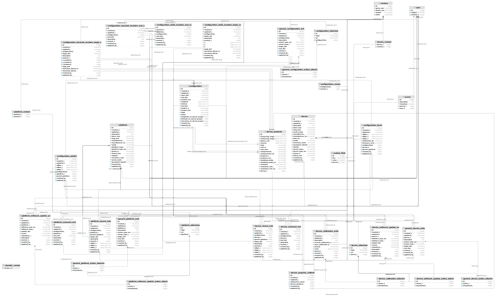

# API for Sensor Management System SMS 

[](https://gitlab.hzdr.de/hub-terra/sms/backend/-/commits/master)
[](./README.md) [](#)
[](https://gitlab.hzdr.de/hub-terra/sms/backend/-/jobs?job=unittest-lint)
[](./docs/requirements_licenses.md)
[](./app/project/static/swagger.json)
[](#)



RESTful API service in Python for managing sensor metadata using [flask](https://flask.palletsprojects.com/en/1.1.x/).

### Documentation

This Project uses OpenAPI to describe both the service model (the API in general, endpoints, request 
metadata like headers, authentication strategies, response metadata, etc.),
and it also covers the HTTP request/response body using a bunch of keywords
based on JSON Schema. 

[See Swagger file in gitlab](app/project/static/swagger.json)
Or  navigate to **`$HOST/rdm/svm-api/v1/docs`**

[For Health check navigate to $HOST/rdm/svm-api/v1/healthcheck**]()


### Technical Specs

- python 3.6+: Python Language supported and tested
- Flask: Micro Python Web Framework, good for microservice development and python WSGI apps.
- [OpenAPI](https://swagger.io/specification/) 3: specification to describe both the service model
- [Flask-REST-JSONAPI](https://flask-rest-jsonapi.readthedocs.io/en/latest/index.html): 
flask plugin for JSON Schema to describe an instance of JSON data, like the a HTTP request
 or response.
- [Docker](https://docs.docker.com/get-started/overview/): A containerization tool for better devops
- [Docker Compose](https://docs.docker.com/compose/): Tool for defining and running multi-container Docker applications


### Local Development

**Note**: For running elasticsearch it may be necessary to increase the maximal
map count for the virtual memory:

```
sudo sysctl vm.max_map_count=262144
```

#### How to pass a mocked JWT to the API for testing

To work with mocked JWT you need at first to change the app setting in the `compose.env` file:

`APP_SETTINGS=project.config.TestingConfig`
Then you can get the JWT by running:

`docker-compose exec app  python manage.py test project.tests.generate_test_jwt`

#### Dummy & demo data

To fill the database with demo data for testing you can use the demo sql data as follows:
> docker cp [OPTIONS] CONTAINER:SRC_PATH DEST_PATH|-
```
docker cp ./backend/data/emo_paltforms_data.sql orchestration_db_1:/docker-entrypoint-initdb.d/dump.sql
docker-compose exec db -u postgres psql postgres postgres -f docker-entrypoint-initdb.d/dump.sql
```

### Usage

After having installed the dependencies, then just run the following commands to use it:

[Simple CRUD](docs/usage.md)

### Test

[How to run the tests](docs/test.md)

### Filter & Include & sort

[How to user filters](docs/filtering.md)

## CLI commands for admins

<details>
<summary>CLI commands</summary>


**user deactivation/reactivation**

When attend to deactivate/activate a user. Use users cli.

```
# Deactivate a user
python manage.py users deactivate srcuserubject@ufz.de

# Deactivated and provide a substituted user
python manage.py users deactivate srcuserubject@ufz.de --dest-user-subject=destusersubject@ufz.de

# Activate a user
python manage.py users reactivate srcuserubject@ufz.de
```

**Model updates & migrations**

When writing changes to the models. Use migrations.

```
# To generate a migration after doing a model update
python manage.py db migrate

# To sync Database
python manage.py db upgrade

# To rollback
python manage.py db downgrade
```

</details>

### Authors

- Dirk Pohle
- Kotyba Alhaj Taha
- Martin Abbrent
- Nils Brinckmann
- Norman Ziegner
- Wilhelm Becker