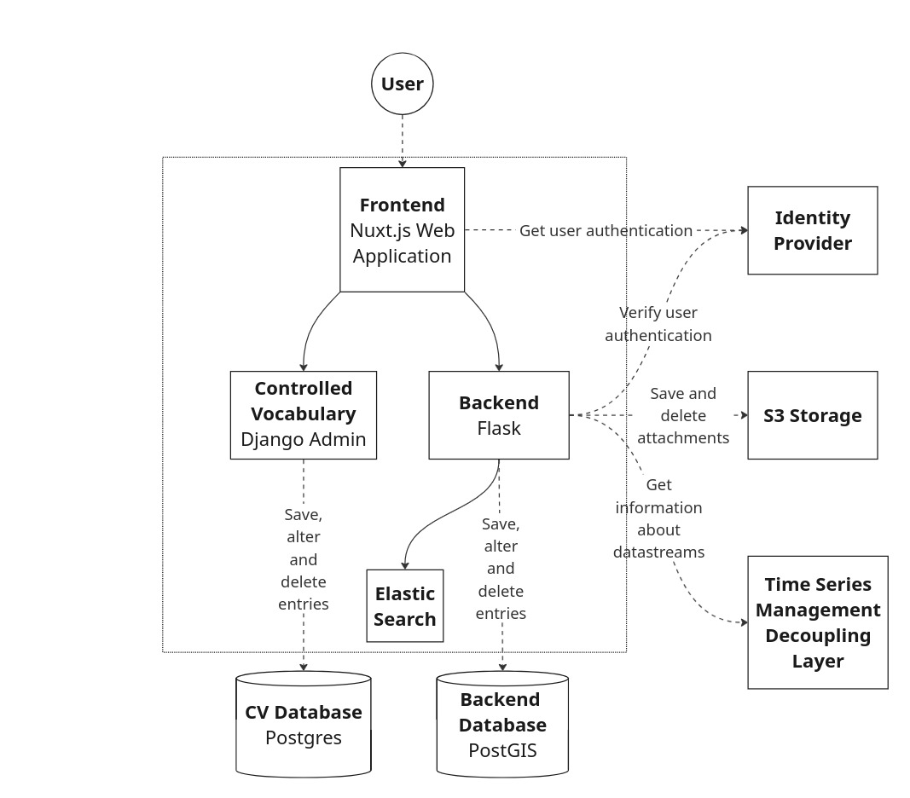

# Orchestration



## Usage

### Self-signed certificate creation
At first, generate a self-signed certificate. You can use the python
script `icessl/ice-ca-certs.py`, which requires the python library *zeroc-icecertutils*
Make sure you execute the script inside the target folder `nginx/certs`.
The self-signed certificate can be generated in the following ways:

- Using `pip`:
  ```shell
  # In case you have an older pip version, upgrade pip beforehand,
  # so that the build process with rust is supported.
  pip install --upgrade pip`
  pip install zeroc-icecertutils
  
  cd nginx/certs/
  ../../icessl/ice-ca-certs.py
  ```

- Using `poetry`:
  ```shell
  poetry install
  cd nginx/certs/
  poetry run ../../icessl/ice-ca-certs.py
  ```

- Using `docker`:
  ```
  docker-compose -f docker-compose.icessl.yml up -d
  mv icessl/server.* nginx/certs/
  ```

### Run the application
1. Copy all files ending with
   ```env.template```. Fill the variables and rename it
   to ```env.dev```

2. Start the containers and run them in background:

```bash
    docker-compose --env-file ./docker/env.dev  up -d
```

3. In order to make sure that the search filter work, you have to create
   the search index on the elastic search:

```bash
docker-compose --env-file ./docker/env.dev exec backend python3 manage.py es reindex
```

This ensures that the search index can be used for full text search
**AND** for keyword search (without it search for specific
device types for example will not work).

Please note: You don't have to run the `reindex` on every startup.
It is important to run it initially and after each change in the structure of the
search index as well (new fields to index for example).


You can watch the output of the containers witch `docker-compose logs`:

```bash
docker-compose logs --follow 
```

## Additional step UFZ developer for Frontend local development - Identity Provider

You can't use `localhost` for local development to authenticate against an Identity Provider, but
you can use `localhost.localdomain`
Here's how you can do this on a Linux (Ubuntu) machine (feel free to search for your own operation
system):

- Adjust `hosts` file:
    - sudo edit /etc/hosts
    - add the following line: 127.0.0.1 localhost.localdomain
    - save

Application urls:

__Backend:__  `https://{HOST}/backend`

__Frontend:__ `https://{HOST}/`

__Controlled Vocabulary:__ `https://{HOST}/cv` 

__Minio Console:__ `https://{HOST}:8443/` 

## Restore the backups (gfz)

Please note: Before you try any restore command, try to test the result locally. You can use the orchestration repos docker-compose file
to start the postgres databases. If you replace the `createbuckets` image with the one for `docker/build/mc/gfz/Dockerfile` you can also
test the minio restore (in the GFZ deployments this service is called `mc`).

For staging and prod we create backups on a regular basis (before every deployment for both, and on a daily basis for prod as well).
Those are stored under 

- `/srv/docker/service/backend-db/backups`
- `/srv/docker/service/vocabulary-db/backups`
- `/srv/docker/service/minio/backups`

We also save those backups for the productive machine on a project share
that is mounted on:

- `/mnt/sms-backup`

which can be found here as well:
- `rzv124n.gfz-potsdam.de:/PROJECT_124n_1/sms-backup`

The backups on the vms themselves are stored for 30 days,
the ones on the project share for 180.

The `*-db` backups are `pg_dump` flies in the compressed postgres binary format. Both can be restored with the `pg_restore`.

It should be possible with a command like this (not tested yet):

```
docker-compose -f docker/deployment/gfz/staging/docker-compose.yml exec -T backend-db pg_restore -d backend -Fc --clean --create' < /srv/docker/service/backend-db/backups/example.dump
```

You may also want to use the `-e` flag for pg_restore, so that it stops in the very first error.

It should be possible to restore the vocabulary-db in the very same way.

For the minio the restore is different:

- Make sure your minio server runs and that the bucket was already created.
- Start a new mc container with a bash session and mount your backup tar.gz file somewhere in the container file system.
- Extract all the data in an temporary folder.
- Register the minio client (`mc alias set`). See the /backup.sh command to check how to do it.
- Run the `mc mirror` command with our temporary folder as first argument, and your $minio/$bucket as second argument. You should check the
  possible flags for this command in order to care about creation dates, over the settings for overwriting existing files
  and the option to also remove entries that are not in the backup.
- There is currently no strategy to restore the metadata - we save them to keep track of the user uploads (if the user wasn't allowed
  to upload a file, we can check who was responsible for that)

## How to add new environment variables to the project
You have to look for many places. Keep in mind, that you always have look in the specific repository (e.g. `frontend` or `backend`) __and__ the orchestration repository 

### Frontend
#### In frontend repository
##### Usage in code
- Access environment variable via `process.env.YOUR_VARIABLE`
- Variable can be used directly if it starts with "NUXT_ENV_" (see Nuxt doc on [environment variables](https://nuxtjs.org/docs/configuration-glossary/configuration-env/))
- Otherwise add `nuxt.config.js` to `env:{...}`, you can then add via `process.env.YOUR_VARIABLE` (see Nuxt doc on topic [environment variables](https://nuxtjs.org/docs/configuration-glossary/configuration-env/))
##### UFZ Dockerfile
Add as new argument/variable to dockerfile
- `docker/deployment/ufz/Dockerfile` 
    ```
    ARG YOUR_VARIABLE
    ENV YOUR_VARIABLE $YOUR_VARIABLE
    ```
##### Institute-specific docker-compose.yaml(s)
Extend the following yamls under `environment` with your variable
- `docker-compose-gfz-local-with-staging-vm.yml`
- `docker-compose-ufz-local.yml`
##### In the CI/CD pipeline
- In the `.gitlab-ci.yml` [Link](https://gitlab.hzdr.de/hub-terra/sms/frontend/-/blob/master/.gitlab-ci.yml) add your variable to the appropriate stages for GFZ (`build-deploy-static-files-gfz`) and UFZ (`build-deploy-image-ufz`)
    - under `variables` add your new environment variable
        -  __be careful__ if you write the value hard-coded or set it via CI/CD variable (see next point "Setting CI/CD in Gitlab")
    - Under `script` add the line `--build-arg NUXT_ENV_[VARIABLE_NAME]=$[VARIABLE_NAME] \` and replace `[VARIABLE_NAME]` with your new variable
###### Setting CI/CD variables in Gitlab
- Go to the HZDR gitlab in the browser to the frontend repository, go to Settings > CI/CD
    - URL: (https://gitlab.hzdr.de/hub-terra/sms/frontend/-/settings/ci_cd)
    - Add under __Variables__ your variable with the appropriate value
#### In the Orchestration repository
##### Update env files
- Extend `docker/env.template` with your environment variable
- Extend `docker/env.dev` with your environment variable
    - You use this when starting the services via the docker-compose.yml in the orchestration repository
##### Extend docker-compose.yml
- Extend the service `frontend` in the section `environment` with your new environment variable