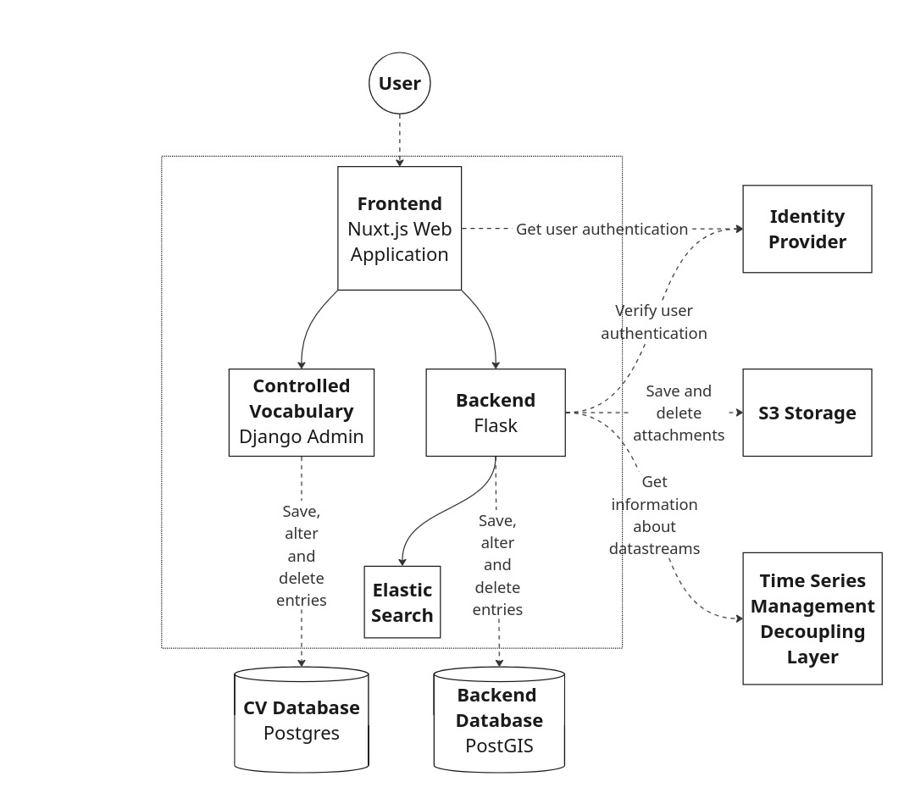

<!--
SPDX-FileCopyrightText: 2021 - 2025
- Kotyba Alhaj Taha <kotyba.alhaj-taha@ufz.de>
- Nils Brinckmann <nils.brinckmann@gfz-potsdam.de>
- Tobias Kuhnert <tobias.kuhnert@ufz.de>
- Norman Ziegner <norman.ziegner@ufz.de>
- Rubankumar Moorthy <r.moorthy@fz-juelich.de>
- Helmholtz Centre Potsdam - GFZ German Research Centre for Geosciences (GFZ, https://www.gfz-potsdam.de)
- Helmholtz Centre for Environmental Research GmbH - UFZ (UFZ, https://www.ufz.de)
- Research Centre Juelich GmbH - Institute of Bio- and Geosciences Agrosphere (IBG-3, https://www.fz-juelich.de/en/ibg/ibg-3)

SPDX-License-Identifier: EUPL-1.2
-->


[](https://doi.org/10.5281/zenodo.13329925)

# Helmholtz Earth & Environment Sensor Management System

The Sensor Management System (SMS) allows the comprehensive
acquisition, administration and export of metadata of platforms,
sensors and measurement configurations by stations and campaigns
operated in the Helmholtz research field Earth & Environment.

Information on specific setups can be summarized and made available
as metadata together with the data for scientific evaluations,
making the data genesis permanently traceable and transparent via
provenance tracking. In the data management cycle, the service
particularly supports the acquisition of additional information
during data collection and prepares the publication of research
data with associated metadata by capturing and providing relevant
information about the measurement setup during data generation.
The service is targeted at the work of scientists and technicians
in the earth and environmental sciences, but also offers sufficient
flexibility for use in other domains as well as individual extension
and customization possibilities due to the use of common standards.

## License

[EUPL-1.2](https://joinup.ec.europa.eu/sites/default/files/custom-page/attachment/2020-03/EUPL-1.2%20EN.txt)

## Authors

- [Nils Brinckmann](https://orcid.org/0000-0001-8159-3888)
- Kotyba Alhaj Taha
- [Tobias Kuhnert](https://orcid.org/0009-0002-3854-3417)
- [Marc Hanisch](https://orcid.org/0000-0001-5272-4674)
- Maximilian Schaldach
- Florian Gransee
- [Daniel Sielaff](https://orcid.org/0009-0002-8606-9385)
- [Tim Eder](https://orcid.org/0009-0005-1965-931X)
- Luca Johannes Nendel
- [Norman Ziegner](https://orcid.org/0000-0001-7579-216X)
- [Hannes Bohring](https://orcid.org/0009-0007-5103-5886)
- [Rubankumar Moorthy](https://orcid.org/0000-0002-3567-1475)
- Wilhelm Becker
- [Martin Abbrent](https://orcid.org/0000-0003-1252-9107)
- Erik Pongratz
- [Dirk Ecker](https://orcid.org/0000-0003-4241-9208)
- [Christof Lorenz](https://orcid.org/0000-0001-5590-5470)
- [Paul Remmler](https://orcid.org/0000-0001-8900-9009)
- [Vivien Rosin](https://orcid.org/0009-0003-9261-6696)
- Marie Schaeffer
- [Florian Obsersteiner](https://orcid.org/0000-0002-7327-8893)
- [Jannes Breier](https://orcid.org/0000-0002-9055-6904)

## Development

The development of this project takes place in
https://codebase.helmholtz.cloud/hub-terra/sms/orchestration
in the Helmholtz Gitlab.

There is also a mirrored version https://github.com/sensor-management-system/orchestration
on GitHub.

In case you have problems or questions, please use https://codebase.helmholtz.cloud/hub-terra/sms/orchestration/-/issues/new
to create an issue.

The development is done via feature branches that are merged into the main branches once they are reviewed by another developer. All merge requests need to provide an entry in the CHANGELOG.md file.

All changes in the main branch are automatically deployed on a staging server, so that we can see if everything is ready to be released.

Releases are done by setting tags on the main branch.

## Used By

This project is used by the following research centers:

- GFZ: https://sensors.gfz.de
- UFZ Leipzig: https://web.app.ufz.de/sms/
- Karlsruhe Institute of Technology: https://sms.atmohub.kit.edu/
- Research Centre Jülich: https://sms.earth-data.fz-juelich.de/

## Changelog

You can find the versions and their changes in [CHANGELOG.md](./CHANGELOG.md).

## Architecture



## Deployment

The SMS is usually run within a Docker Container according to the following steps.

Please note: For GFZ specific parts take a look in [docs/deployments/GFZ.md](the GFZ deployment
markdown file).

### Set up Controlled Vocabulary

Before we can start the SMS-Container, we have to set up the SMS Controlled Vocabulary (which contains terms and defintions used for filling the SMS) as a Git Submodule:

```bash
git submodule init
git submodule update
```

### Run the application

```bash
docker compose up -d
```

Visit http://localhost

Use one of the users specified in [keycloak/docs/Specification for sms.md](./keycloak/docs/Specification for sms.md) to login.

### Integrate demonstrator data for faster deployment

You can use your own test data to be inserted directly into the database during your development process. For this, please follow these steps:

1. __Make sure that you `db` service is up and running__
2. `chmod +x preset-database.sh`
3. `cp ./sql/preset-development-and-test-data.sql.example ./sql/preset-development-and-test-data.sql`
4. Update the `./sql/preset-development-and-test-data.sql` file to your needs (__HINT__: If you use hard coded IDs make sure to update the corresponding sequences or you'll encounter problems)
5. run `./preset-database.sh`

### More information

For more advanced institute specific information, please take a look [here](docs/deployments/).
## Demo

If you just want to try out the Sensor Management System, you are welcome to do
so on [our test instance](https://sensors-sandbox.gfz.de).

⚠️ Please be aware that the data you enter there will not be stored permanently
and the instance should not be used for productive work!

## API Reference

The OpenAPI specification can be explored interactively on the SMS instances.
For example on [sensors.gfz.de](https://sensors.gfz.de/backend/api/v1/openapi).

## Environment Variables

A list of all supported Environment Variables can be found in ```./docker/env.template```.
There are also some notes about some of the usages and values of the env variables.

If you want to change any of these variables, rename the ```env.template``` to ```env.dev``` via

```bash
cp ./docker/env.template ./docker/env.dev
```

and re-start the container using

```bash
docker compose --env-file ./docker/env.dev  up -d
```

## Persistent identifiers

The SMS allows to the users to get persistent identifiers for their devices, platforms,
configurations and sites.

For devices, platforms and configurations we use the [B2INST](https://b2inst.gwdg.de).
We send PIDINST metadata, register those in the system and get a persistent identifier
in return.

Every change in the SMS on instruments published in the B2INST will be updated
automatically.

Please note that the metadata in the B2INST is completely public.

## User documentation

In the [wiki](https://codebase.helmholtz.cloud/hub-terra/sms/service-desk/-/wikis/home)
we wrote some information on how the users can interact with the system, the structure
of the different pages and some best practices.

## FAQ

### How is the group management done?

Group management happens on side of the identity provider. For the productive
usages in the helmholtz centers we usually use the Helmholtz ID.
They provide group management features with virtual organizations or resource
capabilities.
Both of them work similar, that they provide an entry in the
eduperson_entitlement attribute of the user information.
Those entries are used as permission groups in the SMS.

The virtual organizations are meant to represent a project that might be used
in various applications. You can think about having a measuring campaign and you
use a nextcloud folder, the SMS and some kind of time seires management system.
All of those applications could use the same virtual organization, so that
the management of adding the members only needs to be done once.
Virtual organizations are usally managed on the user side.

In contrast resource capabilities are meant to be managed by the providers
of a service. They might add users and move them around into sub groups.
A use case for this is to give a group of users the permissions to use an instance
of the SMS for example.

The SMS supports both kind of groups.


### What is export control?

Export control related information are there to have all the information needed to send devices to remote locations in other countries.

For example there are regulations that forbid to use of devices with parts of from the US to be used in Cuba.

Special care is needed for devices that can be used for military usage (mostly refered as
"Dual use").

At GFZ there are collegues that must take care of this categorization: sensor-management-system-export-control@gfz.de

## Appendix

### TSM Endpoints

We include all the tsm endpoints in the database and can use the `manage.py loaddata <path>` command to add or
update those.

The current approach is to store them in the TSM_ENDPOINTS env variable as an json array, to write it to an temporary file
and to load it with the `loaddata` command:

```
    - docker compose -f docker/deployment/gfz/staging-dev/docker-compose.yml exec -T backend sh -c "echo '$TSM_ENDPOINTS' > /tmp/tsm_endpoint_fixture.json"
    - docker compose -f docker/deployment/gfz/staging-dev/docker-compose.yml exec -T backend python3 manage.py loaddata /tmp/tsm_endpoint_fixture.json
```

The content of the TSM_ENDPOINTS variable looks like this:

```javascript
[
  {
    "pk": 1,
    "model": "TsmEndpoint",
    "fields": {
      "name": "Specific tsm endpoint",
      "url": "https://somewhere.in.the/web"
    }
  }
]
```

Feel free to add your tsm endpoint here.

Please note: Regarding that we may want to provide a central instance in the future, it makes sense to keep the ids of the
ids of the endpoints distinct. So to have pk=1 for GFZ, pk=2 for UFZ, pk=3 for FZJ, pk=4 for KIT and so on. Doing so can
make an merge of the data much easier (but it is also possible to work around it).

### Export control

The export control workflow implemented in the SMS is there to allow export control
officers on the centres to store information if a device or a platform can be
used for military uses (dual use) and requires extra documents when transported
to different countries.

While the usual handling in the SMS is based on physical devices, the export control
works on their device types - in this case the combination of manufacturer & model - so
that the check needs to be done just once for a group of devices or platforms.

The permission to handle those information is bound to the `EXPORT_CONTROL_VO_LIST`
env variable. It is a comma seperated list that points to the full qualified name
of a virtual organization (VO). If you use a sub group of your VO it will look like this: `urn:geant:helmholtz.de:group:<VO Name>:<Group Name>#login.helmholtz.de`.
The full name of the group muss be added to the `EXPORT_CONTROL_VO_LIST`.

For the GFZ we have a `sensor-management-system-export-control` group within myprofile.
This is visible as `urn:geant:helmholtz.de:gfz:group:sensor-management-system-export-control#idp.gfz-potsdam.de` within the Helmholtz AAI - and this is the value that is
used in the `EXPORT_CONTROL_VO_LIST` variable.

### MaTS and STA

One of the use cases of the SMS is to be able to provide metadata for a standardized api
access. In the DataHub we decided to go with the Sensor Things API (STA), as it is an
OGC standard that is in use in a couple of other international initiatives, like Water4All.

[MaTS](https://codebase.helmholtz.cloud/hub-terra/mats)
(Meta data and time series data for STA) is a component that fetches the SMS data and
transforms it to payloads ready to be stored into STA following the
[STAMPLATE](https://codebase.helmholtz.cloud/stamplate/jsonschemas) schema
definitions.

## How to cite

> Brinckmann, N., Alhaj Taha, K., Kuhnert, T., Abbrent, M., Becker, W., Bohring, H., Breier, J., Bumberger, J., Ecker, D., Eder, T., Gransee, F., Hanisch, M., Lorenz, C., Moorthy, R., Nendel, L. J., Pongratz, E., Remmler, P., Rosin, V., Schaeffer, M., … Ziegner, N. (2024). Sensor Management System - SMS (1.16.1). Zenodo. [https://doi.org/10.5281/zenodo.13329926](https://doi.org/10.5281/zenodo.13329926)

## See also

- [sms_interface](https://codebase.helmholtz.cloud/aida/sms_interface)
- [MaTS](https://codebase.helmholtz.cloud/hub-terra/mats)
- [B2INST API](https://docs.eudat.eu/b2inst/v3-rest/overview/)
