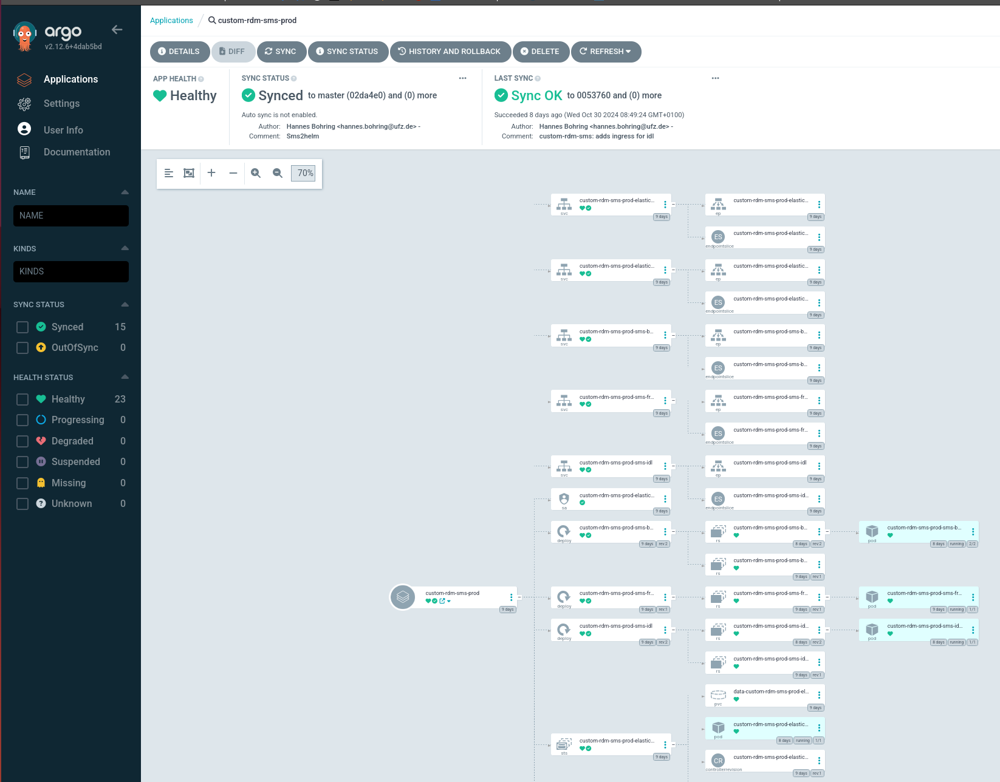

<!--
SPDX-FileCopyrightText: 2024
- Hannes Bohring <hannes.bohring@ufz.de>
- Helmholtz Centre for Environmental Research GmbH - UFZ (UFZ, https://www.ufz.de)
SPDX-License-Identifier: EUPL-1.2
-->
# Deployment on UFZ-Kubernetes (Wombat)

Very simple stripped-down configuration files for SMS-Helm-Charts. 
The whole configuration can be found in UFZ-Admin-Repo. Here you can easily update the Docker-Image-Versions
of the SMS-Components.

```yaml
...
  sms-backend:
    
    nginx:
      image:
        tag: "ufz-backend-1.16.2"
...
```

Just change it in the Yaml-File and push it to Git. A component in the cluster (ArgoCD) will look at this
file in the repo and try to reconciliate automatically (for stage) and semi-automatically (for prod).

For prod somebody needs to sync it manually within ArgoCD




