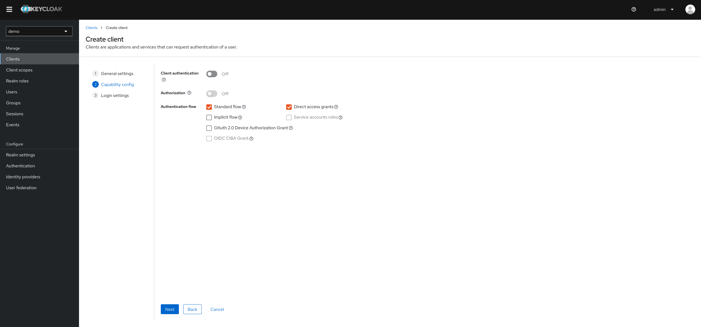

<!--
SPDX-FileCopyrightText: 2020 - 2023
- Nils Brinckmann <nils.brinckmann@gfz-potsdam.de>
- Tobias Kuhnert <tobias.kuhnert@ufz.de>
- Helmholtz Centre Potsdam - GFZ German Research Centre for Geosciences (GFZ, https://www.gfz-potsdam.de)
- Helmholtz Centre for Environmental Research GmbH - UFZ (UFZ, https://www.ufz.de)

SPDX-License-Identifier: EUPL-1.2
-->

# Configuration 

## How the Keycloak was setup to mimic the Helmholtz AAI

### Start the docker compose setup

- Start docker compose setup

  - `docker compose up -d`

- visit: http://keycloak:`KEYCLOAK_PORT`
  - login using 
    - username: `admin` 
    - password: `admin`
  - __Note__ these are set by the environment variables `KEYCLOAK_ADMIN` and `KEYCLOAK_ADMIN_PASSWORD`

### Create a realm

  - click the drop-down-menu on the left side (right under the header) where currently `Keycloak` is selected
    - click the button `Create realm`
  - name it `local-dev`
  - click `create`
  - __Note__ The images here use the realm name `demo` instead of `local-dev`. You can name it as you like - as long as you use the right realm name in your client applications configuration.


### Create a client communicating over backend channel
  - go to `clients` in left menu
  - click `create client`
  - fill in the form (see pictures)
  - __Note__ It is important to set the `Client authentication` __on__ for the client to enable the authentication over the backend channel





### Create client scopes
  - these scopes will be needed to mock some properties of the helmholtz aai
  - you will need the scopes `openid`,  `eduperson_entitlement`,  `eduperson_principle_name`, `eduperson_unique_id`
  - go to `client scopes` in left menu
####   `openid` scope:
- __Note__ This scope is needed (and must also be send by the client) to provide access to the `userinfo` endpoint
- click `create client scope`
  - name: openid
  - Type: Default


#### `eduperson_principal_name` scope
- click `create client scope`
  - name: `eduperson_principal_name`
  - Type: default
- add mapper to `eduperson_principal_name` scope
  - __After save__: Go to the `Mapper` tab of the saved scope
  - click `Configure a new mapper`
  - Select `user property`
  - Fill in the form:
    - Name: `Mapper eduperson_principal_name`
    - Property: `username`
    - token claim name: `eduperson_principal_name`


####  `eduperson_entitlement` scope
- click `create client scope`
  - name: `eduperson_entitlement`
  - Type: default
- add mapper to `eduperson_entitlement` scope
  - __After save__: Go to the `Mapper` tab of the saved scope
  - click `Configure a new mapper`
  - Select `Group Membership`
  - Fill in the form:
    - Name: `Mapper eduperson_entitlement`
    - token claim name: `eduperson_entitlement`
    - full group path: `off`


#### `eduperson_unique_id` scope
- click `create client scope`
  - name: `eduperson_unique_id`
  - Type: default
- add mapper to `eduperson_unique_id` scope
  - __After save__: Go to the `Mapper` tab of the saved scope
  - click `Configure a new mapper`
  - Select `user property`
  - Fill in the form:
    - Name: `Mapper eduperson_unique_id`
    - Property: `id`
    - token claim name: `eduperson_unique_id`
    

### Add the scopes to your client

  - go to `clients` in left menu
  - select you client, e.g. `sms-client`
  - go to `client scopes` tab
  - click `add client scope`
  - select the previously created ones
    - select type: `default`


### Create a group

  - you can adopt the procedure to create more
  - __Note__ 
    - The original Helmholtz Virtual Organization groups look something like this: `urn:geant:helmholtz.de:group:VO-Name:group-name:ufz-sms-admin#login.helmholtz.de`, so the name of the groups must follow the naming schema
    - the `ufz-sms-admin` stand for `provider-service-role`
      - Provider of the service: `ufz`
      - Service: `sms`
      - Role: `admin`
    - For the sms there are two roles defined/used: `admin` and `member`
    - These are handled by the institute decoupling layer service of the respective institutes
  - go to `Groups` in left menu
  - click `create group`
  - fill in the form:
    - Name: `a:a:a:group:VO:Group1:admin#`

### Create a user
  - you can adopt the procedure to create more
  - go to `Users` in left menu
  - click `Create new user`
  - fill in the form:
    - Email verified: `yes`
      - __Note__ This is import to set to `yes` otherwise the user has to confirm its email adress
    - username: `user1`
    - email: `user1@provider.org`
    - first name: `User1`
    - last name `One`
    - Groups: 
      - click `join groups`
      - selected the previous created group
      - click `join`
    - click `create`


  #### Add user credentials
- __After create__: Go to `credentials` tab
  - click `Set password`
  - fill in the form:
    - Password: `password`
    - Password confirmation: `password`
    - Temporary: `Off`
      - __Note__: If you set this to `on` the user has to update its password on first login. With off you can use the dummy password everytime


### Update Authentication flow
- go to `Authentication` in left menu
- click on `browser`
- Set `Requirement` for `Cookie` to `Disabled

__Reason for doing this__: 

If the cookie is disabled, you have to enter a password everytime you login. This is important, because otherwise it would not be possible to change the user. And it's acutal the same behavior as the aai.


### Update SSO Session Max
- go to `Realm Settings` in left menu
- click on tab `Sessions`
- Set `SSO Session Max` to `10` `Seconds`

__Reason for doing this__: 
There was a problem, when you logged in with one user in the sms and then  logged out and tried to login with another user:

```
You are already authenticated as different user 'user1' in this session. Please sign out first.
```
This change fixes this.


### Export the settings to an file
  - this file can be used to start the keycloak server and fill it with some initial data    
    - prerequisite - docker compose work:
      - first create a ` keycloak-init.json` in you local docker compose setup
      - mount it to the keycloak service using volumes
      - ```yaml
            volumes:
              - "./keycloak/keycloak-init.json:/opt/keycloak/data/import/keycloak-init.json"
        ```
    - Run the following command to export the file
  ~~~bash
  docker compose -f "./docker-compose.yml" --env-file "./docker/env.dev" exec keycloak /opt/keycloak/bin/kc.sh export --file /opt/keycloak/data/import/keycloak-init.json --users same_file --realm local-dev
  
  or 
  
  docker compose exec keycloak /opt/keycloak/bin/kc.sh export --file /opt/keycloak/data/import/keycloak-init.json --users same_file --realm local-dev
  ~~~
  - to use that file on start use the following service command in the `docker-compose.yml`
  - ```yaml
        command:
          - start-dev
          - --import-realm     
    ```

- __Important/Troubleshooting export file__

  - If you export the json file it could be possible that you could have some problems, when you start the keycloak using it

  - See: https://howtodoinjava.com/devops/keycloak-script-upload-is-disabled/

  - To solve the problem:

    - > So, to solve the “Script upload is disabled” error **clean the realm JSON file by removing the ‘`authorizationSettings`‘ node** altogether. After cleaning the realm file, the import will run successfully and the server will start.
